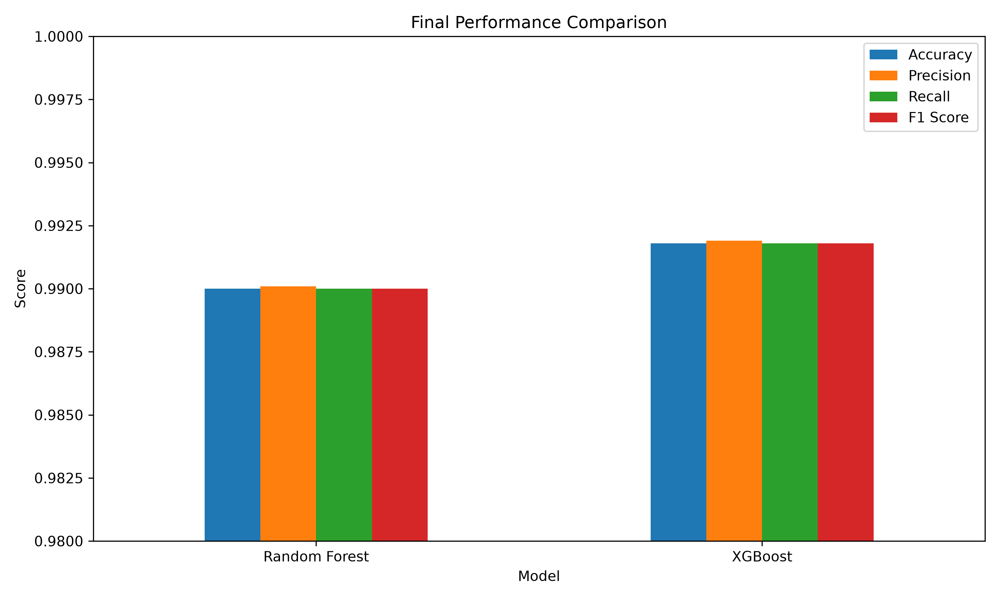
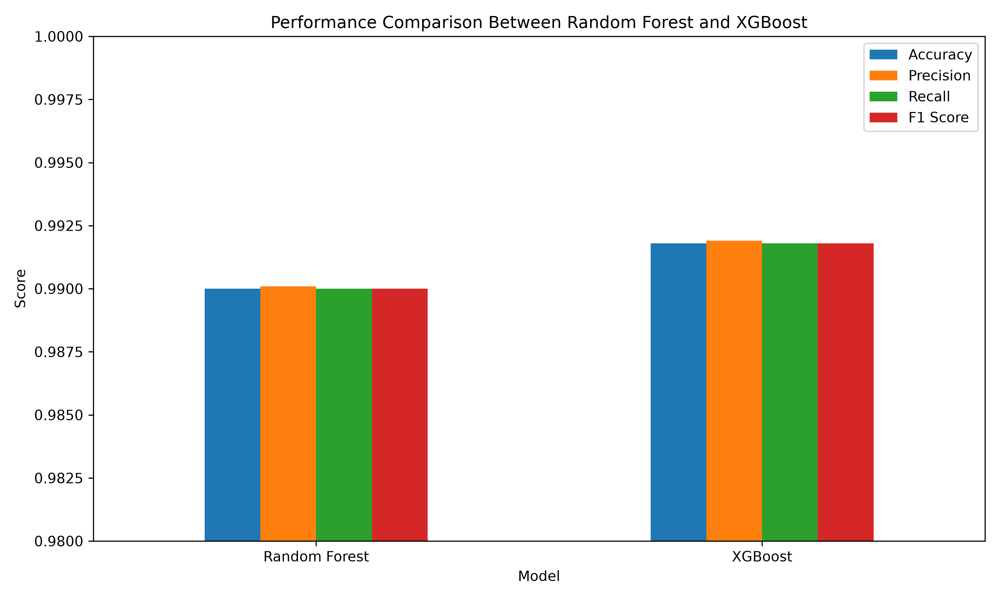
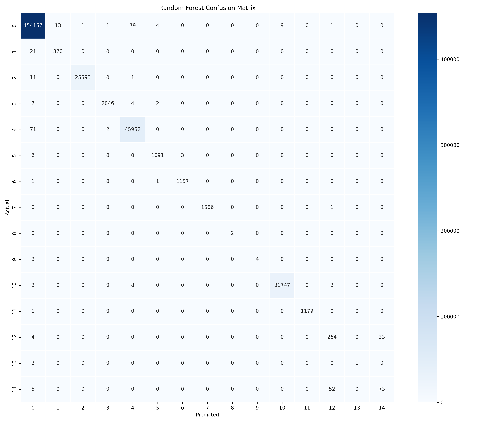
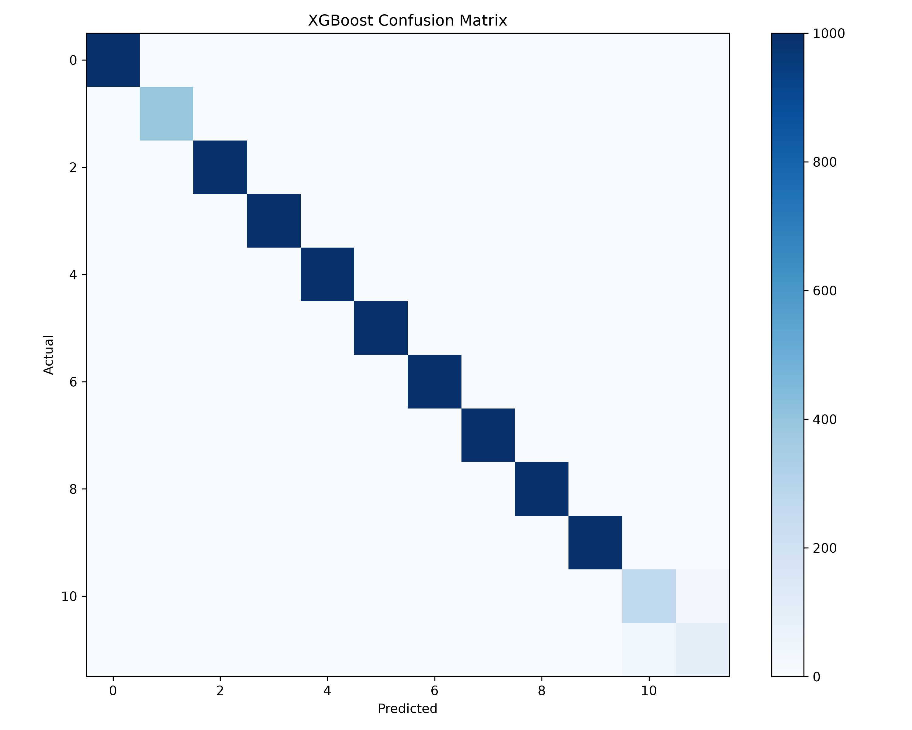
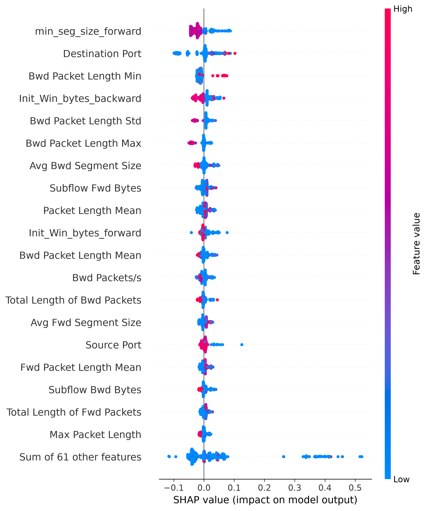
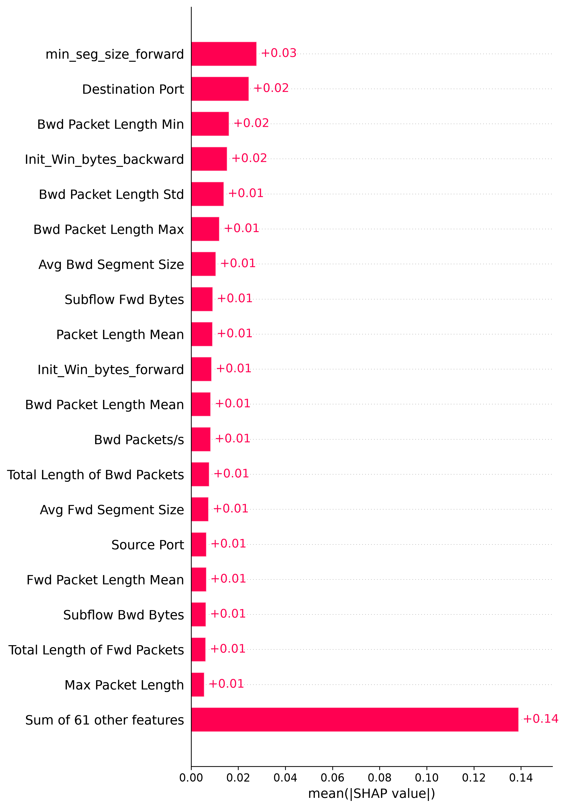
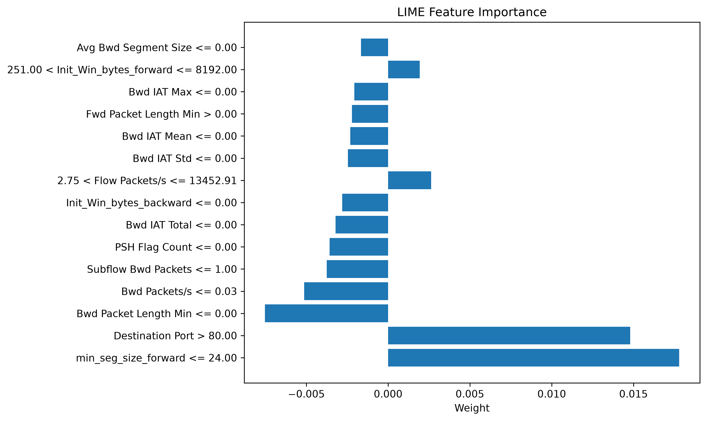
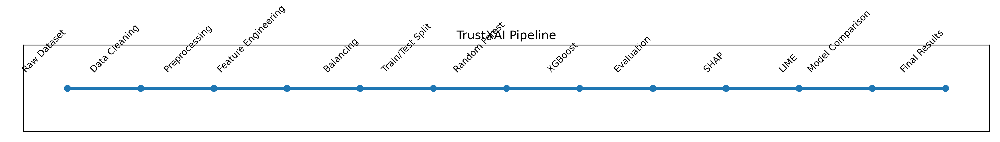

# 🛡️ TrustXAI: Explainable AI Framework for Multiclass Network Intrusion Detection


An Explainable Artificial Intelligence (XAI) framework for multiclass network intrusion detection using Machine Learning and Explainable AI techniques. The project combines traditional machine learning algorithms with modern explainability methods to provide accurate and transparent cyberattack detection.

---

# 📖 Overview

TrustXAI is a research project developed as part of the Bachelor's degree in Cyber Security & Networking Engineering at the University of Central Lancashire (UCLan).

The framework focuses on detecting multiple categories of network intrusions using machine learning models while explaining every prediction through Explainable Artificial Intelligence (XAI) techniques such as SHAP and LIME.

---

# ✨ Key Features

- Multiclass Network Intrusion Detection
- Data Cleaning & Preprocessing
- Feature Engineering
- Random Forest Classifier
- XGBoost Classifier
- Model Comparison
- Explainable AI using SHAP
- Explainable AI using LIME
- Feature Importance Analysis
- Performance Evaluation
- Confusion Matrix Visualization
- IEEE-style Research Paper

---

# ⚙️ Technologies

- Python
- Jupyter Notebook
- Scikit-learn
- XGBoost
- Pandas
- NumPy
- Matplotlib
- SHAP
- LIME

---

# 📂 Dataset

This project uses the **CICIDS2017** dataset for multiclass network intrusion detection.

Dataset characteristics include:

- Multiple network attack categories
- Benign network traffic
- High-dimensional feature set
- Large-scale network flow records
- Real-world intrusion detection scenarios

---

# 📁 Repository Structure

```text
TrustXAI-Explainable-Network-Intrusion-Detection
│
├── images/
├── notebooks/
├── paper/
├── results/
├── src/
├── LICENSE
└── README.md
```

---

# 🔄 Research Workflow

1. Exploratory Data Analysis (EDA)
2. Data Cleaning
3. Data Merging
4. Data Preprocessing
5. Feature Engineering
6. Model Training
7. Model Evaluation
8. Model Comparison
9. SHAP Explainability
10. LIME Explainability
11. Performance Analysis
12. Research Conclusions

---

# 📊 Results

## Overall Performance



---

## Model Comparison



---

## Random Forest Confusion Matrix



---

## XGBoost Confusion Matrix



---

# 🧠 Explainable AI

## SHAP Summary



---

## SHAP Feature Importance



---

## LIME Feature Importance



---

# 🏗️ Project Pipeline



---

# 🚀 How to Run

## Clone the repository

```bash
git clone https://github.com/Ahmed-Adnan-AlSalman/TrustXAI-Explainable-Network-Intrusion-Detection.git
```

## Install dependencies

```bash
pip install -r requirements.txt
```

## Launch Jupyter Notebook

```bash
jupyter notebook
```

Run the notebooks in numerical order starting from:

- 01_EDA.ipynb
- 02_Data_Cleaning.ipynb
- 03_Data_Merging.ipynb
- 04_Data_Preprocessing.ipynb
- 05_Model_Training.ipynb
- 06_Improved_Model.ipynb
- 07_Feature_Importance.ipynb
- 08_SHAP_Explainability.ipynb
- 09_LIME_Explainability.ipynb
- 10_XGBoost_Model.ipynb
- 11_Model_Comparison.ipynb
- 12_Final_Results_&_Discussion.ipynb
- 13_Research_Contribution_&_Project_Summary.ipynb

---

# 📄 Research Paper

The complete research paper is available in:

```text
paper/
```

---

# 🔮 Future Work

- Deep Learning-based Intrusion Detection
- Real-time Threat Detection
- Federated Learning
- Cloud-based Deployment
- Transformer-based Models
- Explainable Deep Learning Models

---

# 📚 Citation

If you use this repository in your research, please cite:

```text
Ahmed Adnan Al-Salman.

TrustXAI: Explainable AI Framework for Multiclass Network Intrusion Detection.

University of Central Lancashire (UCLan), 2025.
```

---

# 👨‍💻 Author

**Ahmed Adnan Al-Salman**

BSc (Hons) Cyber Security & Networking Engineering

University of Central Lancashire (UCLan)

Basra, Iraq

📧 Email: ahmadadnanalsalman@gmail.com

💼 LinkedIn:
https://linkedin.com/in/ahmedadnan93

💻 GitHub:
https://github.com/Ahmed-Adnan-AlSalman

---

# 📜 License

This project is licensed under the MIT License.
